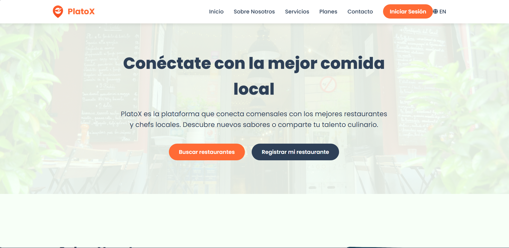

# 🍽️ PlatoX – Local Dining Platform

**PlatoX** is a modern and responsive landing page showcasing a web platform where diners can discover local restaurants, and restaurants or chefs can register their business to gain visibility.

> Academic project developed for the **Open Source Development Appilcations - UPC** course.

---

## 🖼️ Preview



---

## ✨ Features

- 🌐 Multilanguage support (EN/ES)
- 📱 Fully responsive design
- 🍴 Sections for diners and restaurant/chef users
- 💳 Clear and professional membership plans
- 🎨 Custom flat-style animated illustrations
- 🧭 Modern, clean navigation

---

## 📁 Project Structure

```bash
.
├── index.html               # Main landing page
├── css/
│   └── styles.css           # Global and responsive styles
├── js/
│   └── main.js              # Language switch and navbar functionality
├── locales/
│   ├── en.json              # English translations
│   └── es.json              # Spanish translations
├── img/
│   ├── logo.png
│   ├── hero-background.png
│   ├── about-illustration.png
│   ├── service-diner.png
│   └── service-chef.png
└── README.md                # This file

```

## 🌍 Language Switching
Click the 🌐 icon in the navigation bar to toggle between English and Spanish.

Translations are managed through /locales and loaded via main.js.

📸 Visual Credits
Illustrations were AI-generated and customized for this landing page.

Icons are provided by Font Awesome.

## 🧪 Technologies Used

- HTML5
- CSS3 (Flexbox + Media Queries)
- JavaScript (DOM + LocalStorage)
- JSON (for i18n)
- Font Awesome
- Google Fonts (Poppins)

## 📚 License
- This project is for academic and non-commercial use.
- Reuse is allowed for educational purposes only with proper attribution.

## 👨‍💻 Author
- SabroSaic Development Team

- Course: Open Source Development Appilcations – Universidad Peruana de Ciencias Aplicadas (UPC)

- Year: 2025

## 🏁 Project Status
- ✅ Completed and ready to deploy.
- 📦 Compatible with GitHub Pages, Netlify, or Vercel.